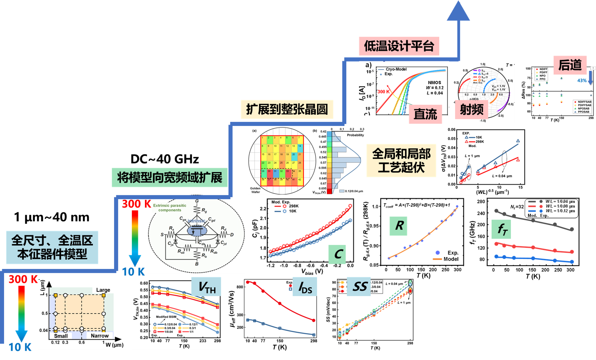
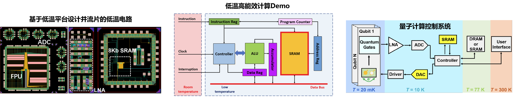

###**研究目标**
聚焦于先进工艺CMOS器件低温物理及电性，探索一条建立能覆盖全温区、全尺寸、宽频域的通用低温直流/射频器件模型及低温电路设计平台的可靠道路，为低温电路设计与芯片制造构建桥梁。

{: style="height:auto;width:1200px"}

###**低温电路研究**
量子计算外围控制电路设计

面向高能效计算的低温存算系统设计

丰富的流片机会

{: style="height:auto;width:1200px"}