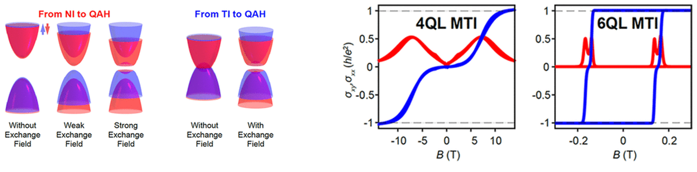
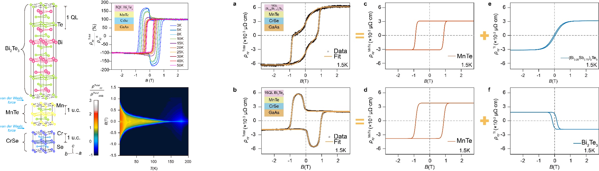

#**MBE**

###**Quantum anomalous hall effect**
Designation and fabrication of high-quality samples is essential to realize multi-field controllable QAH effect. Our group has fabricated wafer-scale magnetic topological insulator Cr doped (Bi,Sb)2Te3 thin films by molecular beam epitaxy (MBE) and found related topological phase transition through precise variation of thickness and doping level. 

{: style="height:auto;width:1200px"}

###**Tailoring the hybrid anomalous Hall effect (AHE)**
With the shrinking of CMOS size, the problem of power consumption and economic cost become more and more prominent. In order to get over the bottleneck, in Post-Moore era, the development of multi-functional spintronics devices with operating electronic spin states is of great significance. Our group achieved the manipulation of electronic spin states through tailoring of magnetic order and topological order independently based on magnetic topological insulator heterostructure, which manipulated the sign of the Berry phase-associated anomalous Hall effect (AHE) component. This in turn unveils a new avenue for MTI heterostructure-based multi-functional applications, such as magnetic storage and magnetic sensors.

{: style="height:auto;width:1200px"}