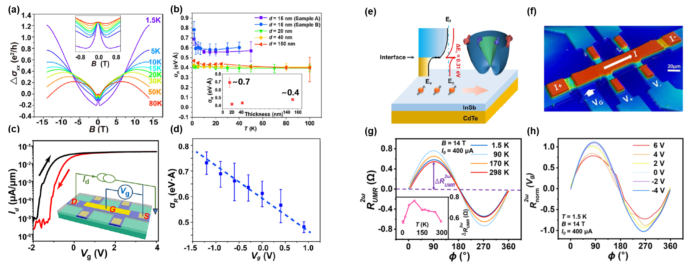
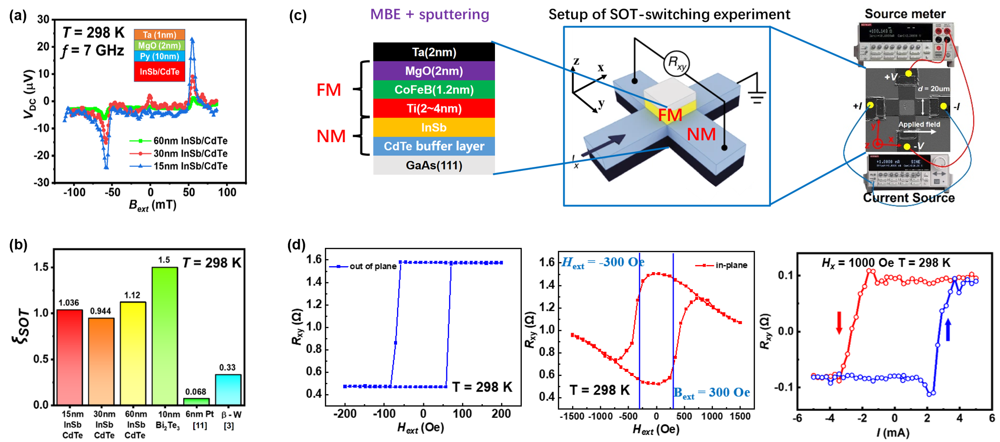

#**SOT DEVICES**

###**Giant Rashba effect and unidirectional magnetoresistance in InSb/CdTe**
Compared with traditional semiconductors, narrow bandgap III-V semiconductors are characterized by small bandgap, low effective mass, high mobility and large spin g-factor. By combining with Ⅱ-Ⅵ semiconductors to prepare heterojunctions, the giant Rashba effect is generated by the energy band bending at the interface. Our group has fabricated high-quality heterojunctions by molecular beam epitaxy (MBE). Through the analysis of WAL phenomenon, the Rashba coefficients at different thicknesses and temperatures were calculated. What’s more, Hall devices are used to study the unidirectional magnetoresistance effect caused by strong SOC.

{: style="height:auto;width:1200px"}

###**InSb/CdTe based spin-to-charge conversion and SOT switching **
Based on the strong SOC brought by band bending of InSb/CdTe system, in order to apply it into spintronic devices, our group measured the spin-charge conversion efficiency of this system through ST-FMR measurement. The efficiency is far higher than the one in traditional heavy metal system. The read-write test of the prototype device shows that the SOT inversion threshold current density of our system is ten times smaller than the one of traditional heavy metals, which proves that InSb/CdTe is a highly competitive spintronics system and has broad prospects in the application of spin memory devices.

{: style="height:auto;width:1200px"}