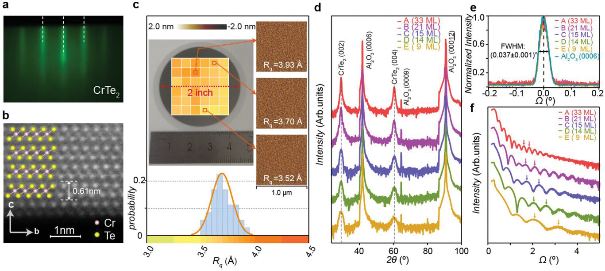

# **Welcome to Talent's Portal!**

## **WHAT IS TALENT（crtl V过来的初稿，假装有这么个东西）**
The Advanced Low-dimensional Electronics & Nano-science Team (TALENT) are developing chip-scale sensor, actuator and microsystem for cutting-edge applications.  [Specific research areas of interest](./Research/SOT/SOT.md) include Micro-/Nano-Electro-Mechanical System (M/NEMS), novel multiferroic materials, PiezoMEMS transducers, CMOS IC as well as their applications in smart systems and Internet-Of-Things (IOT) etc.   We welcomes all STEM background people to join and explore fascinating micro/nano-technologies.

## **RECENT NEWS（内容远远不够，有待丰富）**

* [SOT](./Research/SOT/SOT.md)

——————————————————————————————————————————————————
[X. Liu, P. Huang, Y. Xia et al. have published one paper "Wafer-Scale Epitaxial Growth of the Thickness-Controllable Van Der Waals Ferromagnet CrTe2 for Reliable Magnetic Memory Applications" in ADVANCED FUNCTION MATERIALS !](./Archives/1001/1001.md)

2023-09-08

To harness the intriguing properties of 2D van der Waals (vdW) ferromagnets (FMs) for versatile applications, the key challenge lies in the reliable material synthesis for scalable device production. Here, the epitaxial growth of single-crystalline 1T-CrTe2 thin films on 2-inch sapphire substrates are demonstrated. Benefiting from the uniform surface energy of the dangling bond-free Al2O3(0001) surface, the layer-by-layer vdW growth mode is observed right from the initial growth stage, which warrants precise control of the sample thickness beyond three monolayer and homogeneous surface morphology across the entire wafer. Moreover, the presence of the Coulomb interaction at the CrTe2/Al2O3 interface plays an important role in tailoring the anomalous Hall response, and the structural optimization of the CrTe2-based spin-orbit torque device leads to a substantial switching power reduction by 54%. The results may lay out a general framework for the design of energy-efficient spintronics based on configurable vdWFMs.

## **About Talent**
# "此处可以放课题组合影.jpg" 

 .
Together, we form an unbreakable alliance

## **下方可放合作部门的链接等**

:material-emoticon-happy: [Place To Find Emojis' Icons](https://squidfunk.github.io/mkdocs-material/reference/icons-emojis/)
:material-motorbike: [Far Ahead](https://www.bilibili.com/video/BV1Nh4y1v7w3/)
:simple-bilibili: [Bilibili](https://www.bilibili.com/video/BV1Nh4y1v7w3/)
